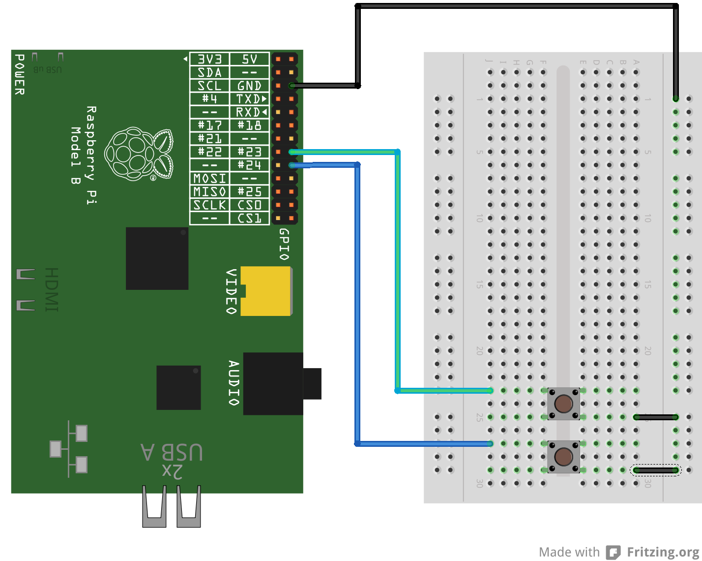

% Detecting a button press
% Piffin
%

# Detecting a button press

The Raspberry Pi has many GPIOs (General Purpose Input/Output) that we can use. They can either be set as an input or an output.
In this lesson we'll hook up a button and write a program that can detect if it's pressed.

## What will be learnt

* create a basic circuit
* detecting input with the Raspberry Pi
* looping
* conditionals
* using the time library

## Facilities

* 1 Raspberry Pi per 2 or 3 students
* 1 Piffin experimenter kit per 2 or 3 students

## Time frame

1 hour assuming that Raspberry Pis are setup and students already have logins.

# Lesson Plan

## What do we need?

Ask the students to think about what is needed to detect a button press:

1. being able to detect the state of the pins on the Raspberry Pi with python
2. when the button is pressed, the voltage on the Raspberry Pi's pin has to change
3. we have to keep checking the button, if we only check once we could miss it

The first 2 points are the most important. It can be good to let the students work out point 3 on their own.

## Build the circuit

To detect if a button is pressed we need to make the voltage change when the button is pressed. We have 2 options:

1. set the voltage on the pin to be 3.3v, and when the button is pressed, connect the pin to 0v, or
2. set the voltage on the pin to be 0v, and when the button is pressed, connect the pin to +3.3v

When we set an input pin to be 0v or 3.3v we say we are *pulling it down* or *pulling it up* respectively.

In this example, we'll set the button pin to be *pulled up* with python. 
This means we have to wire the button so when pressed it pulls the pin down.

Another way of referring to 0v is to use the word *ground*, or *gnd*.

### Parts list

* 2 buttons
* 3 male to female wires

### Circuit diagram

Follow the diagram to build the circuit. Things to look out for are:

* check the components are inserted properly, with their legs deeply inserted into the breadboard

## Writing a python program with Idle

### Using Idle

If you've not used Idle before, see the introduction in [The LED lesson plan](../led/LED.html#using-idle)

You may want to ask your students to start Idle as the super user now rather than later. See [Running the program](#running-the-program) for details on this. Otherwise, they can start Idle as a normal user by double clicking the Idle icon on the desktop.

Ask your students to create a new file (file->new). All the code will be written in this window. Before we can run it, we need to save it as a new file (don't forget to add the .py extension). Then press f5 to run the program. 

### Detecting the button with python 

We need to use the RPi.GPIO library to communicate with the GPIOs. 
The first line imports the new library, and the second sets the library so we can refer to the pins by their physical number: 

~~~ python
import RPi.GPIO as GPIO
GPIO.setmode(GPIO.BOARD)
~~~

Now we store the button's pin number in a variable, so it's easy to refer to later.
Then we set that pin to be an input, and for it to be *pulled up*:

~~~ python
button_pin = 16
GPIO.setup(button_pin,GPIO.IN, pull_up_down=GPIO.PUD_UP)
~~~

Finally, we can check if the button is pressed like this:

~~~ python
if GPIO.input(button_pin) == False:
    print("button pressed")
~~~

Challenge your students to finish the program themselves. 

The most common thing to forget is that we need to keep checking (also called polling) if the button is pressed.
If they've forgotten to do this (with a loop), ask them to press and hold the button *before* running the program.
If their code is correct, the program will now detect the button as being pressed. 
Ask them how they can keep checking the state of the button.

Here's how we can wrap the test in an endless loop:

~~~ python
while True:
    if GPIO.input(button_pin) == False:
        print("button pressed")
~~~

Show the students the CPU monitor in the bottom right hand corner, it goes really high when the program is running, 
because the Pi is checking the button as fast as it can!

### Running the program

When it comes to testing the program there are a few things to bear in mind:

* We can only access the GPIOs as the super user.
* We'll get a warnings once we've used the GPIOs once.

We can ignore the warnings, but we need a way to run the program as the super user to get anything to work. 
We'll do this by closing Idle, and restarting as the super user. Open a terminal (start menu->accessories->lxterminal) and type:

    gksudo idle

A warning will pop up which can be ignored. Then re-open your program and run it with f5. 

Remember that we expect a warning about the GPIO already being in use.

### Worked example for 2 buttons

***button.py

# Extension activities

## Add the extra button

We've only written the code to detect one button. Now add new code to use the second button. Some tips:

* We don't need to import any of the libraries again
* Create a new variable for the second button pin
* Duplicate the line that set the GPIO up as an input, but using the new variable
* Now use the same lines as before to detect the button, but using the new variable

## Making the program more CPU friendly

When we run the program we can see from the CPU monitor that the Pi has to work really hard. This is because we're checking the status
of the buttons over and over again, as fast as possible. We can add a tiny delay in our loop to give the CPU a breather using the time library:

~~~ python
import time
time.sleep(0.1)
~~~

You should see the CPU usage drop considerably.

## Making the program more CPU friendly part 2

A different way of detecting if a button is pressed is by using interrupts. Instead of checking as fast as possible (polling), we
ask the Pi to interrupt us when something happens. The code is a bit more complicated, but much less CPU intensive. If you look at the following
code, the while loop doesn't do anything any more. We just wait for the interrupts to happen.

***button_int.py

## Turning off the warnings

We can get rid of the annoying warnings whenever we run a program that uses the GPIOs using this python code:

    GPIO.setwarnings(False)

# Additional Resources

## Piffin documents

* Check our [python cheatsheet](../cheatsheet.html) for basic python commands
* Download the [example code](button.py)
* The [online version of this document](button.html)
* The [printable version of this document](button.pdf)

## The RPi.GPIO Library

For more details on using inputs, [check the reference](https://sourceforge.net/p/raspberry-gpio-python/wiki/Inputs/).
