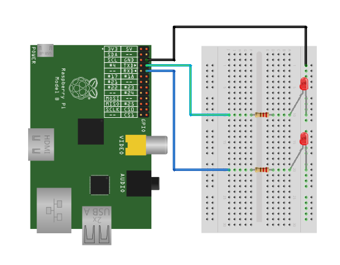

% Flashing an LED
% Piffin
%

# Flashing an LED

Flashing an LED is a good first example of controlling something in the real world with a computer. Once we can control an LED we can move on to things like motors and buzzers. The Raspberry Pi has many GPIOs (General Purpose Input/Output) that we can use. They can either be set as an input or an output.

## What will be learnt

* create a basic circuit
* control output with the Raspberry Pi
* looping
* using the time library

## Facilities

* 1 Raspberry Pi per 2 or 3 students
* 1 Piffin experimenter kit per 2 or 3 students

## Time frame

1 hour assuming that Raspberry Pis are setup and students already have logins.

# Lesson Plan

## What do we need?

Ask the students to think about what is needed to flash a light on and off. It's straight forward, but there are a few things that need to be considered.

* a loop, so the LED will continue flashing
* pausing a short moment - without a pause the LED will flash so fast it will just look dim!
* being able to control the pins on the Raspberry Pi with python

## Writing a python program with Idle

### Using Idle

If you've not used Idle before, it's a programming environment that makes it easier for us to write python programs. When you start it up, you get the 'shell', which let's us easily experiment with single python commands. As soon as we press enter, the python command will run. Try typing in some basic maths operators:

~~~
10 + 10
5 * 25
~~~

The shell is a great way to show a concept quickly, and then get the students to copy what you've done to see on their own computer.

When we want to move onto writing longer programs, we can make a new window (file->new) and then write our code using an editor. Before we can run it, we need to save it as a new file (don't forget to add the .py extension). Then press f5 to run the program. Check the [Additional Resources](#idle-tips) for some more on Idle.

### Looping

Before we add the electronics, let's get a python program running that creates the loop and the time delay. Use the shell to show a loop:

~~~
while True:
    print("hello world!")
~~~

Show the students the CPU monitor in the bottom right hand corner, it goes really high when the program is running, because the Pi is printing 'hello world!' as fast as it can!

### The time library

If we want to slow it down, we can use the time library. Libraries allow us to use code written by other people - so we don't need to write everything ourselves.

Show the students how to import the time library in the shell:

~~~
import time
time.sleep(5)
~~~

You may also notice that if you wait after typing 

    time.

Idle will show you the different functions we can use from the time library.

### Putting it together

Ask the students to start writing a new program (using the file->new) menu. The program should:

* loop the following forever:
    * print 'hello' on one line
    * wait 1 second
    * print 'world' on one line
    * wait 1 second

The code will look something like this:

~~~
import time

while True:
    print("hello")
    time.sleep(1)
    print("world")
    time.sleep(1)
~~~

Now if we can control an LED as well as printing, we'll be done!

## Build the circuit

### Parts list

* 2 LEDs
* 2 resistors
* 3 male to female wires

### Circuit diagram

Follow the diagram to build the circuit. Things to look out for are:

* reversed LEDs (they only work one way) 
* check the components are inserted properly, with their legs deeply inserted into the breadboard

### Controlling the LEDs from python 

We need to use another library to control the LEDs. Get the students to add these lines to the top of their hello world code.

The first line imports the new library, and the second sets the library so we can refer to the pins by their physical number: 

    import RPi.GPIO as GPIO
    GPIO.setmode(GPIO.BOARD)

Now we store the pin number in a variable, so it's easy to change later, and then set that pin to be an output:

    led_pin = 8
    GPIO.setup(led_pin, GPIO.OUT)

Finally, we can turn an LED on with this line:

    GPIO.output(led_pin, True)

And off with this line:

    GPIO.output(led_pin, False)

Challenge your students to finish the program themselves. If they get stuck, see the example below.

### Running the program

When it comes to testing the program there are a few things to bear in mind:

* We can only access the GPIOs as the super user.
* We'll get a warnings once we've used the GPIOs once.

We can ignore the warnings, but we need a way to run the program as the super user to get anything to work. 
We'll do this by closing Idle, and restarting as the super user. Open a terminal (start menu->accessories->lxterminal) and type:

    gksudo idle

A warning will pop up which can be ignored. Then re-open your program and run it with f5. Remember that we expect a warning about the GPIO already being in use.

### Worked example

***flash.py

# Extension activities

## Different patterns

* Try making the LED flash in different ways.
* How fast can you make if flash? How fast before you can't see it flashing?

## Morse Code

Send secret messages with [Morse Code](http://en.wikipedia.org/wiki/Morse_code).

* Students can define 2 functions, one for a dot and one for a dash
* Sequence the dot and dash functions with a big conditional statement
* Use the conditional in a loop to spell out words 

## Running the program from the command line

Learning how to run our programs from the command line is useful, because then we can them to run automatically when the Raspberry Pi boots up, or to run aat a specific time.

Open a terminal (start menu->accessories->lxterminal) and use `cd` to navigate to the directory where the code is stored. We then need to use 2 commands to run the program:

* `sudo` - this lets us run the program as an admin user
* `python` - needed to run the python program

For example we can run a program called `flash.py` in a directory called `mydirectory` with the following:

    cd mydirectory
    sudo python flash.py

## Turning off the warnings

We can get rid of the annoying warnings whenever we run a program that uses the GPIOs using this python code:

    GPIO.setwarnings(False)

# Additional Resources

## Idle Tips

* Make the font bigger for projection with option->configure idle
* In the shell, you can use alt-p (previous) and alt-n (next) to scroll through your history of commands
* If you forget to add a .py extension to your files then syntax highlighting will stop working
* When you get an error, if you right click on the line number you have an option to go to that line in the program

## Turning all outputs on with the all_on.py script

When the Raspberry Pi starts, some pins are high and others low. So one student could connect an LED that will light, and another student's won't. This can seem like a problem with the LED, but it may well be that the output isn't on yet.

The all_on.py script is provided to turn on all the outputs at the beginning of a lesson. Run it by typing this on the command line:

    sudo python all_on.py
